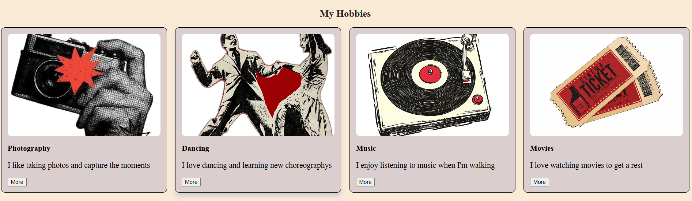
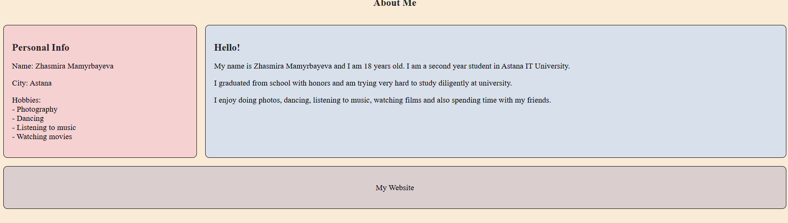
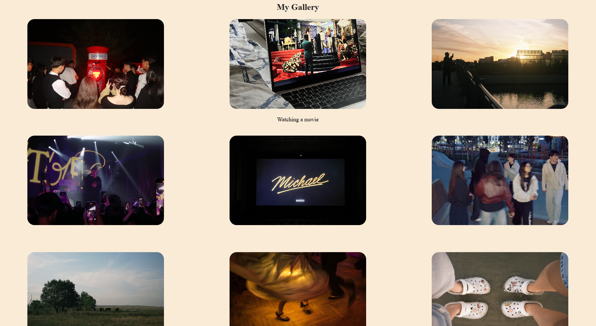
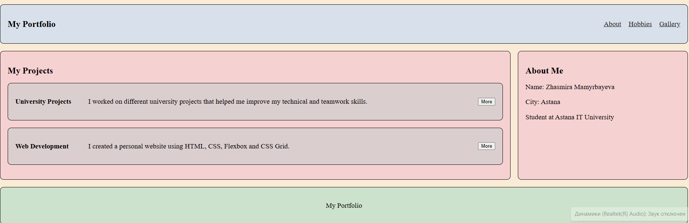

## Assignment 2
## Student Information
## Name: Zhasmira Mamyrbayeva  
## Group: SE-2539

This project is a personal website created using html and css. The purpose of this assignment was to practice flexbox and css grid. The website includes information about me, my hobbies, projects, and a photo gallery.

## Task 0
I created navigation bar with the logo and navigation links.
I used flexbox to place the logo and links horizontally, create space between the logo and navigation links, add gaps between the links, vertically center the elements.

## Task 1
I created My Hobbies section with four cards: photography, dancing, music, movies. Each card contains an image, title, description, and button.
I used Flexbox to place the cards in a row and gap to add space between them. I also added a shadow hover effect.

## Task 2
I created a page layout using css grid. The layout includes a header, sidebar, main content, and footer. 

## Task 3
I created an image gallery with nine images. I used css grid to create three equal columns and three rows. I used gap to create consistent spacing between the images. I also added a hover effect that displays a caption when the mouse is over an image.

## Task 4
I created a portfolio layout using grid to place the projects area on the left and the sidebar on the right and flexbox for the navigation bar and project cards.

## Conclusion
In this assignment, I practiced using flexbox and css grid to create different website layouts. I learned how to organize elements, create card layouts, build an image gallery, and combine flexbox and grid in one webpage
